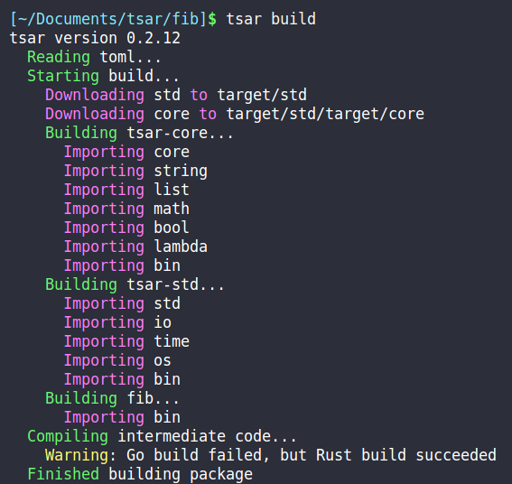
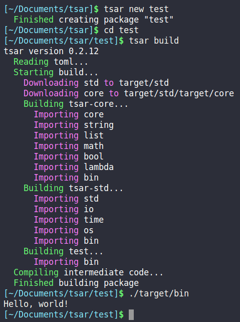
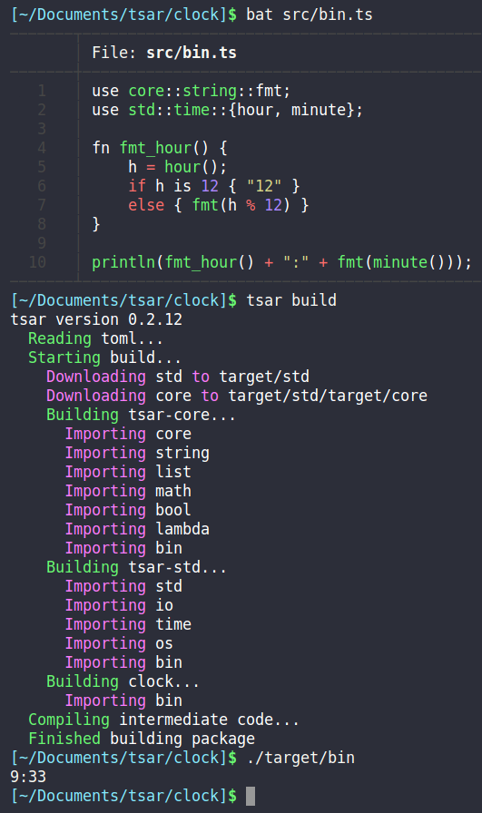
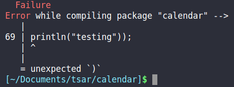

# tsar

Tsar is a dynamically typed, ahead of time compiled programming language. Tsar targets the [Xasm intermediate representation](https://github.com/adam-mcdaniel/xasm), which can compile to either Golang or Rust. As a result, if a Tsar program fails to build with Golang (the primary target language), Rust is used as a fallback.



## Features

- Dynamic Typing
- Golang and Rust foreign function interface
- Package management system
- First class object and function programming
- Pretty error messages
- Rust inspired syntax
- Python inspired programming

```
tsar x.x.x
adam-mcdaniel <adam.mcdaniel17@gmail.com>
Compiler for the Tsar programming langauge

USAGE:
    tsar [SUBCOMMAND]

FLAGS:
    -h, --help       Prints help information
    -V, --version    Prints version information

SUBCOMMANDS:
    build    Build a Tsar package
    help     Prints this message or the help of the given subcommand(s)
    new      Create new Tsar package
    run      Run a Tsar package
```

## Installation
TODO: Make a document for each respective OS

### Install Rust (and optionally Go)

#### MacOS / Debian / Ubuntu
First, install [Rust](https://www.rust-lang.org/tools/install).
```bash
# For *nix only
# Installs Rust
curl --proto '=https' --tlsv1.2 -sSf https://sh.rustup.rs | sh
```

Then install [git](https://git-scm.com/downloads).
```bash
# For debian based OS only
sudo apt install git
```

If you want to target golang (highly recommended), install it [here](https://golang.org/dl/)
```bash
# For debian based OS only
sudo apt install golang-go

# For MacOS, use the golang link above.
```

#### Windows

Note that Tsar builds significantly slower on Windows. Expect a couple of seconds of extra time when compiling / running your tsar packages. Using Tsar on linux is recommended.

Before you start, you must install [visual studio](https://visualstudio.microsoft.com/downloads/), and [git](https://git-scm.com/downloads). You will not be able to compile without these!


Be sure to follow the instructions carefully, and use the defaults for both installers.

- Install [Rust](https://www.rust-lang.org/tools/install).
- Install [Golang](https://golang.org/dl/)

### Install Tsar

After following the instructions for your respective operating system, run the following in your shell.

```bash
cargo install -f tsar
```

After the installation completes, you will be able to create a tsar package!


## Getting Started
TODO: This will become its own book / document in the future

To start, create a tsar package and test it.

```bash
# Where I will create my package
cd ~/Documents/tsar

# This will create a package named `test` under a folder with the same name
tsar new test
# Enter the folder
cd test

# Edit your program
nano src/bin.ts

# Compile your package
tsar build
# Your executable is in the `target` folder!

# Alternatively, you can `run` your package
tsar run
```



Now we can start programming!

## Syntax

Although Tsar is meant to behave somewhat like Python, its syntax is inspired by Rust.



If you do somehow make a syntactical mistake, Tsar will try to help correct you.



### Comments

Tsar uses C and C++ style comments.

```rust
// Im a comment!!
/*
    Im also a comment!
*/

println("Im not a comment!");
```


### Use statements

`Use` statements allow you to import objects from imported modules.

`Use` statements MUST ONLY be at the top of your file! You may not use `use` statements anywhere else in your code because of code cleanliness. This allows for more readable code.

Use statements must import by name only, you may not use the `*` symbol like in Python.

You can `use` one object from a module like so.
```rust
use core::string::fmt;
```

You can also import multiple objects.
```rust
use core::math::{sin, cos, tan};
```

### Identifiers

There are two major kinds of identifiers: unscoped and scoped names.

Unscoped names are just regular identifiers like `abc123`, `tsar`, `i`, `hey_jude71`.

Scoped names use the `::` operator. This operator lets you access names from within modules.

If I want to call the `hour` function from the `time` module in the `std` module, I can do it like so.

```rust
println(std::time::hour());
```

### Assignment

Assignment in Tsar is done with the `=` operator. Variables are declared when they are first assigned to.

```rust
a = 5;
a = "String";
println(a);
```

### Loops and If Statements

Loops and If Statements are the structures for control flow in Tsar.

If statements are either single or double pronged like so.

```rust
fn odd(n) => n % 2;

fn collatz(n) {
    if odd(n) { 3 * n + 1 }
    else { n / 2 }
}

if true {
    println(collatz(5));
}
```

Parentheses are not required for loop or if statements.

While loops are executed until the test expression is false.

```rust
n = 10
while n isnt 0 {
    println(n);
    n = n - 1;
}

println("loop finished");
```

For loops iterate over each index and value in a list.

```rust
use core::string::fmt;

for index, element in range(0, 10) {
    println("Index of element: " + fmt(index));
    println("Element itself: " + fmt(element));
}
```

For unused index or element values when iterating, use the `_` variable for good convention sake.

### Functions

In Tsar, the stack is shared across different scopes. This means that values returned by functions are simply pushed onto the stack to be retrieved later.

To return a value from a function, just leave the expression to return at the end of your function.

The last line of the function does not require a semicolon.

```rust
fn function_name(a, b) {
    result = a + b;
    result
}
```

Functions that only do one computation can be written like so.

```rust
fn sum(array) => reduce(array, add, 0);
```

Functions written like this do require a semicolon, though.

Anonymous functions can be expressed with the following syntax.

```rust
|a, b| {
    result = a + b;
    result
};
```
This function takes two arguments `a` and `b`, and returns `a + b`.

Functions can be called with the `()` operators like in most other languages.

```rust
f = |a, b| { a + b };
fn increment(n) => n + 1;

println(f(4, 5));
println(increment(0));
```

### Objects

Objects are very useful for encapsulating mutating code. To maintain code cleanliness, Tsar does away with class inheritance.

Objects are defined like so.

The `new` method is used as the constructor for an object. THe `new` method takes at least one argument (the reference to the current instance), and returns that instance.

YOU MUST RETURN YOUR INSTANCE AT THE END OF THE `new` METHOD!!!

```rust
impl Point {
    fn new(self, x, y) {
        self.x = x;
        self.y = y;

        self
    }

    fn goto(self, x, y) {
        self.x = x;
        self.y = y;
    }
}
```

To instantiate your object, use the `new` function.

```rust
p1 = new(Point, 5, 6);
println(p1);
```

Attributes of an object can be accessed similarly to lists with the `[]` operators as well as the `.` operator.

```rust
impl Example {
    fn new(self) {
        self.a = 5;
        self
    }
}

e = new(Example);
println(e["a"]);
println(e.a);
```

## The Prelude

Before you start programming, you should know your available builtin functions imported from the `core` and `std` modules.

#### print
This function prints an object without printing a newline.

```rust
print("test\n");
```

#### println
This function prints an object and a newline.

```rust
println("test");
```

#### list
The following segment creates a list with 3 elements, `[1, 2, 3]`. The `[]` syntax to create a list is just shorthand for creating a call to the `list` functions.

```rust
n = 3
l = list(n, 1, 2, 3);
println(l);
```

#### len
This function returns the length of a list or string.

```rust
println(len("testing"));
println(len([1, 2, 3]));
```

#### push
This function returns a list with an object appended to the end.

```rust
println(push([1], 2) is [1, 2]);
```


#### pop
This function returns
- a list with the last object popped off
- the popped object

```rust
impl List {
    fn new(self) { self.items = []; self }
    fn push(self, item) {
        self.items = push(self.items, item);
    }

    fn pop(self) {
        self.items = pop(self.items);
    }
}

l = new(List);
l.push(5);
println(l.pop());
```


#### range
This function returns a list of values from one number to another (exclusive).

```rust
println(range(0, 3))
```


#### reverse
This function returns a reversed list.

```rust
println(reverse(range(0, 3)));
```


#### map
This function maps a list into another using a function.

```rust
fn increment(n) => n + 1;

println(
    map([0, 0, 0, 0], increment)
);
```


#### filter
This function is used to filter a list for accepted values. It takes a list and a function. For each element in the list, if `f(element)` is true, the item will be placed in the resulting list.

The following will print a list with only odd numbers.
```rust
fn odd(n) => (n % 2) is 1;

println(filter([1, 2, 3, 4, 5], odd));
```


#### reduce
This function is used to reduce a list into an atomic value. Reduce takes a list, a function to reduce with (that takes two arguments itself), and an initial value.

```rust
fn sum(values) => reduce(values, add, 0);
fn factorial(n) => reduce(range(1, n+1), mul, 1);

println(sum([1, 2, 3]));
println(factorial(5));
```


#### new
This function creates an instance of an object.

```rust
impl Point {
    fn new(self, x, y) {
        self.x = x;
        self.y = y;
        self
    }
}

p1 = new(Point, 1, 1);
println(p1);
```

