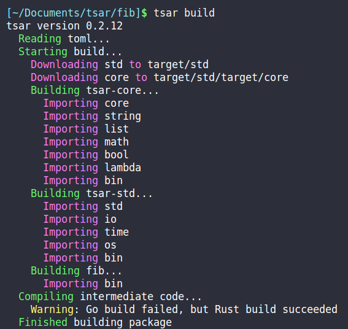

# tsar

Tsar is a dynamically typed, ahead of time compiled programming language. Tsar targets the [Xasm intermediate representation](https://github.com/adam-mcdaniel/xasm), which can compile to either Golang or Rust. As a result, if a Tsar program fails to build with Golang (the primary target language), Rust is used as a fallback.

